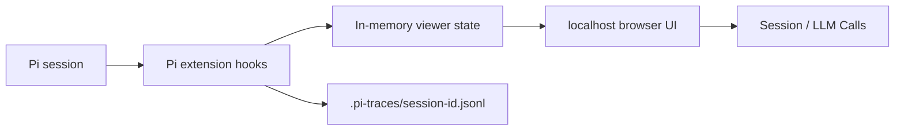

# Pi Trace Viewer

> A local, live observability UI for Pi coding-agent sessions and LLM context.

[中文 README](./README.zh-CN.md)

Pi Trace Viewer answers one practical question: **what did the model actually see?**

It turns Pi session history, branches, compaction, and every pi-ai call into a navigable local UI. You can inspect both the normalized Pi-side context and the provider-specific request that was actually emitted.

## Why Pi Trace Viewer?

### 1. Live observation instead of post-hoc export

Pi `/export` is excellent for reading a completed conversation. Pi Trace Viewer starts with the session and keeps updating while Pi is running, so you can watch branches, tool calls, compaction, and model output as they happen.

### 2. See Pi Context and Provider Payload separately

Every captured call offers two switchable views:

| View | What it shows |
| --- | --- |
| **Pi Context** | The normalized system prompt, messages, and tools handed to pi-ai |
| **Provider Payload** | The backend-specific request after provider templates/API mapping |

Messages are individually collapsible. Markdown is available as both a rendered document and raw source, while the complete JSON remains available in a collapsed section.

### 3. Make compaction inspectable

Compaction calls expose:

- `messages to summarize`: older messages that will be summarized and removed from the active context
- `split-turn prefix`: the beginning of an oversized turn when Pi has to cut through the middle of that turn
- the cut point, compaction reason, token count, and recent-token policy
- the previous summary and extracted file operations
- the provider request used to generate the summary

This makes “why did the model forget something after compaction?” a traceable question instead of a guess.

### 4. Identify repeated calls to the same model

The LLM Calls sidebar uses chronological numbers and shows:

- call number, kind, and turn
- model and API
- prompt excerpt
- tool names or output excerpt
- status, request count, and duration

### 5. Keep long sessions navigable

Single-child chains stay flat. Indentation and connectors appear only for real branches. The Session sidebar scrolls both vertically and horizontally, so long tool arguments and outputs remain accessible.

## Screenshots

These screenshots come from the same real Pi session.

### Realtime Session Viewer vs Pi `/export`

| Pi Trace Viewer (live, navigable, with LLM Calls) | Pi `/export` (complete-history reading) |
| --- | --- |
|  |  |

The viewer keeps the dark terminal-like visual language of `/export` while adding live status, stable branch navigation, click-to-locate behavior, and per-call context inspection.

### Compaction Context


The compaction view exposes the source messages and cut-point metadata. Switch to Provider Payload to inspect the backend-specific summary request.

## How it works



The extension reads Pi's live snapshot and listens to public events including:

- `context`
- `before_provider_request`
- `after_provider_response`
- `message_update` / `message_end`
- `session_before_compact` / `session_compact`
- `session_tree`

## Installation and usage

### One session only

```bash
cd /path/to/pi-trace-viewer
npm install
pi -e /path/to/pi-trace-viewer
```

This affects only the current `pi` process and does not edit Pi settings.

### Global installation

```bash
pi install /path/to/pi-trace-viewer
```

Without `--local`, Pi stores the package reference in `~/.pi/agent/settings.json`, and new Pi sessions load the extension automatically.

Verify the configured packages:

```bash
pi list
```

### Project-local installation

```bash
pi install /path/to/pi-trace-viewer --local
```

This writes the package entry to `<project>/.pi/settings.json` and affects only Pi started from that project.

### Uninstall

```bash
# Global/user installation
pi remove /path/to/pi-trace-viewer

# Project-local installation
pi remove /path/to/pi-trace-viewer --local
```

`pi uninstall` is an alias for `pi remove`. A local-path uninstall removes the settings reference but does not delete your source directory.

## Data and privacy

### Does it modify Pi's native session?

No. The extension does not call `appendCustomEntry` or `appendCustomMessageEntry`, and it does not append records to Pi's native session JSONL. It reads the snapshot supplied by Pi and writes a separate sidecar trace.

Pi's native session remains at:

```text
~/.pi/agent/sessions/<encoded-cwd>/<session-id>.jsonl
```

The extension stores its trace at:

```text
<session-directory>/.pi-traces/<session-id>.jsonl
```

For this project, the path is normally:

```text
/Users/liming/.pi/agent/sessions/--Users-liming-2-Projects-Code-pi-extention-pi-trace-viewer--/.pi-traces/<session-id>.jsonl
```

The viewer keeps current data in memory while Pi is running. The HTTP server binds to `127.0.0.1` and stops with the Pi process. The `.pi-traces` JSONL file is the only persistent data created by this extension.

### Cleaning trace data

Uninstalling the package intentionally leaves old trace sidecars in place. After reviewing the exact session directory, remove only its `.pi-traces` folder if desired:

```bash
rm -rf "/path/to/session-directory/.pi-traces"
```

This is optional and irreversible; it does not delete Pi's native session JSONL.

### Security boundaries

- binds only to `127.0.0.1`
- uses `0700` directory and `0600` file permissions
- redacts credential-shaped JSON fields and sensitive response headers
- intentionally retains prompts, system instructions, tool results, and model output; treat traces as sensitive local data

## Limitations

Pi's internal compaction implementation does not expose its final generic compaction `Context` through the extension API. The extension therefore records two truthful layers:

1. The public `session_before_compact` preparation: source messages, cut point, tokens, and settings
2. The public `before_provider_request` payload: the exact backend request

For historical compactions that happened before trace capture, only the session summary can be restored; the original provider request cannot be reconstructed.

## Development

```bash
npm install
npm run check
```

The check runs strict TypeScript validation and the 10 unit tests.
