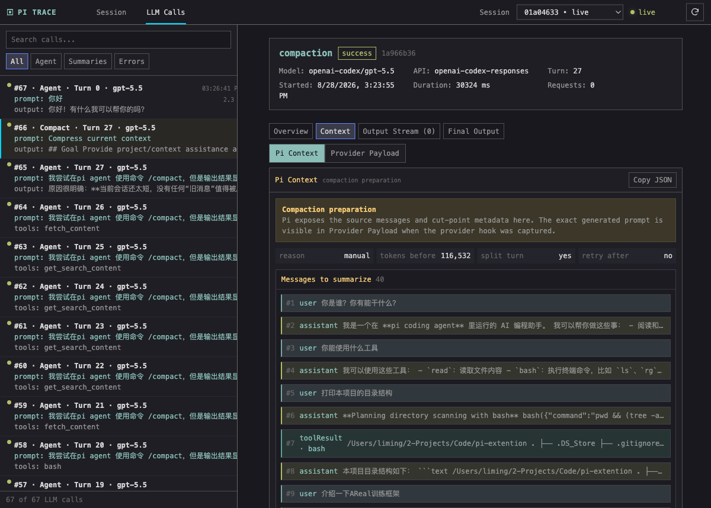
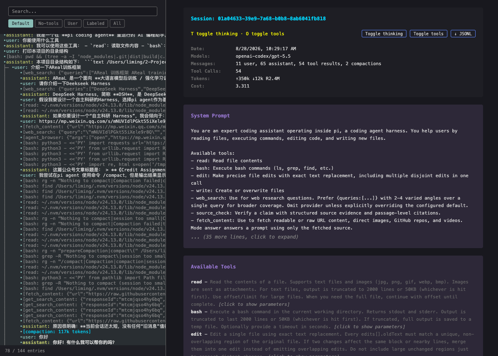

# Pi Trace Viewer

> **Understand what your Pi agent actually sent to the model.**  
> 看清 Pi agent 实际发送给模型的内容。



[中文文档](./README.zh-CN.md) · [English documentation](./README.en.md)

Pi Trace Viewer is a local, live observability UI for Pi coding-agent sessions and `pi-ai` calls. It keeps the familiar dark, terminal-like feel of Pi `/export`, then adds the context-level visibility needed to debug long-running agent workflows.

Pi Trace Viewer 是一个面向 Pi coding agent 和 `pi-ai` 调用的本地实时可视化工具。它保留 Pi `/export` 的阅读体验，同时增加对 LLM Context、Provider Payload、分支和 Compaction 的深度观察能力。

## The core idea / 核心卖点

```text
Pi session → extension hooks → live localhost UI
                         ↘ separate .pi-traces JSONL sidecar
```

### See the real context / 看清模型真正看到的 Context

- **Pi Context** — normalized system prompt, messages, and tools
- **Provider Payload** — backend-specific request after templates/API mapping
- **Compaction** — source messages, split-turn prefix, cut point, token policy, and summary request
- **Output** — thinking, Markdown, tool calls, tool results, streaming events, and final message

### Live session navigation / 实时追踪会话轨迹

- session tree updates while Pi is running
- flat single-child chains and readable true branches
- stable ordering after clicks
- vertical + horizontal sidebar scrolling
- click an entry to show the path up to that point and auto-scroll to its location

### LLM call forensics / LLM 调用取证

Every call is labeled with a chronological number, kind, turn, model/API, prompt excerpt, tools/output, status, request count, and duration. Long messages are collapsible; Markdown has both rendered and raw-source views; raw JSON remains available when you need it.

## Why it is different from Pi `/export` / 与 `/export` 的区别

| Pi Trace Viewer | Pi `/export` |
| --- | --- |
| Live updates during the current session | Static export of a session |
| Dedicated LLM Calls view | Session history only |
| Pi Context ↔ Provider Payload toggle | Rendered conversation view |
| Compaction preparation and provider request | Compaction summary in the timeline |
| Call identity, duration, status, retries | No per-call forensic index |

### Visual comparison / 视觉对比

| Realtime viewer / 实时 viewer | Pi export |
| --- | --- |
|  |  |

### Compaction inspection / Compaction 检查


## Quick start / 快速开始

### One session only / 仅当前会话

```bash
cd /path/to/pi-trace-viewer
npm install
pi -e /path/to/pi-trace-viewer
```

### Global installation / 全局安装

```bash
pi install /path/to/pi-trace-viewer
pi list
```

### Project-local installation / 项目级安装

```bash
pi install /path/to/pi-trace-viewer --local
```

### Uninstall / 卸载

```bash
pi remove /path/to/pi-trace-viewer
# or: pi remove /path/to/pi-trace-viewer --local
```

The viewer starts at `http://127.0.0.1:7890`; `/trace-view` prints the URL again. Use `--pi-trace-port 7891` if another Pi process already owns the port.

## Data safety / 数据安全

The extension does **not** modify Pi's native session JSONL. It reads Pi's live snapshot and writes only a separate trace sidecar:

```text
Pi session: ~/.pi/agent/sessions/<encoded-cwd>/<session-id>.jsonl
Trace:      <session-directory>/.pi-traces/<session-id>.jsonl
```

不会污染 Pi 自己维护的 session。卸载插件不会自动删除 trace；确认路径后可选择删除指定 `.pi-traces` 目录。Trace 中会保留 prompt、system instruction、工具结果和模型输出，请按敏感本地数据处理。

See the full installation, security, limitations, and development notes in [README.zh-CN.md](./README.zh-CN.md) or [README.en.md](./README.en.md).
