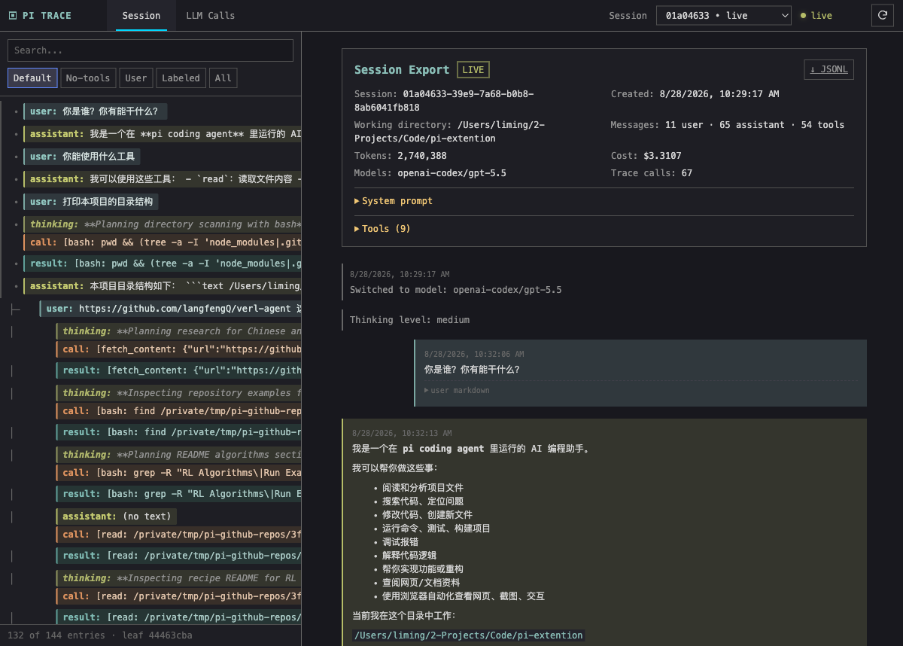
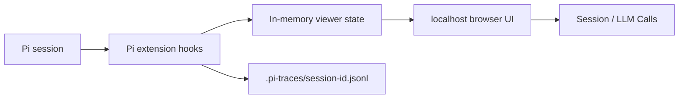

# Pi Trace Viewer

> 面向 Pi coding agent 的本地实时会话与 LLM Context 可视化工具。

[English README](./README.en.md)

Pi Trace Viewer 解决一个很具体的问题：**模型到底看到了什么？**

它把 Pi 的会话轨迹、分支、压缩过程，以及每一次 pi-ai 调用拆开呈现，让你同时看到：

- Pi 层的通用 Context
- 具体 Provider 真正收到的 Payload
- 模型的流式输出、工具调用与工具结果
- Compaction 前后 Context 的变化
- 其他插件写入的 custom message 与 custom state

## 为什么值得用？

### 1. 实时观察，而不是事后导出

Pi `/export` 很适合阅读完整历史；Pi Trace Viewer 则在会话运行时持续更新。你可以边运行 Pi，边在浏览器中观察当前分支、工具调用和模型输出。

### 2. 看清“通用 Context”和“后端请求”的差别

同一次调用提供两个可切换视图：

| 视图 | 你看到的内容 |
| --- | --- |
| **Pi Context** | Pi 交给 pi-ai 的规范化 system prompt、messages、tools |
| **Provider Payload** | 具体后端经过 template / API 映射后真正发送的请求 |

两者不再混在一张原始 JSON 里；每条消息都可以独立折叠，Markdown 同时支持渲染视图和原文视图。

### 3. 把 Compaction 变成可解释的过程

Compaction 调用会展示：

- `messages to summarize`：将被总结并从当前 Context 中移出的旧消息
- `split-turn prefix`：一个过大的 turn 被从中间切开时，其前半部分
- 截断点、压缩原因、token 数、最近消息保留策略
- 上一次 summary、文件操作信息
- Provider 实际收到的压缩请求

这使得“压缩以后模型为什么忘了某件事”可以被追溯，而不是只能猜测。

### 4. 让同一个模型的几十次调用也能定位

LLM Calls 侧栏按时间编号，并显示：

- 调用序号、类型、turn
- model / API
- 触发 prompt 摘要
- 工具名或输出摘要
- 状态、请求次数、耗时

### 5. 分支结构不会把长会话挤出屏幕

单子节点链保持扁平；真正发生 branch 时才增加缩进和连接线。侧栏支持上下、左右滚动，工具参数和长输出不会被强行截断。

### 6. 兼容其他扩展

其他插件写入的 custom message 和 custom state 会使用安全 fallback 渲染。可见 custom message 会显示在 Session 页面，隐藏 custom message 会默认折叠以便调试，所有 custom context 都能在 LLM Calls 中检查。

## 截图

以下截图来自同一个真实 Pi session。

### 实时 Session Viewer vs Pi `/export`

| Pi Trace Viewer（实时、可定位、可切换 LLM Calls） | Pi `/export`（完整历史阅读） |
| --- | --- |
|  |  |

Viewer 保留了 `/export` 的深色、终端风格，同时增加了实时状态、稳定的分支树、侧栏定位和 LLM 调用分析。

### Compaction Context


这里可以直接看到压缩准备阶段的源消息、切分信息和 token 元数据；切换到 Provider Payload 后，可以查看具体后端请求。

## 工作方式



扩展只读取 Pi 提供的 live snapshot，并监听公开事件：

- `context`
- `before_provider_request`
- `after_provider_response`
- `message_update` / `message_end`
- `session_before_compact` / `session_compact`
- `session_tree`

## 安装与使用

### 只对当前会话启用

```bash
cd /path/to/pi-trace-viewer
npm install
pi -e /path/to/pi-trace-viewer
```

只对当前 `pi` 进程生效，不修改 Pi 全局设置。

### 全局安装

```bash
pi install /path/to/pi-trace-viewer
```

默认写入 `~/.pi/agent/settings.json`，之后新启动的 Pi 会话自动加载插件。

验证：

```bash
pi list
```

### 项目级安装

```bash
pi install /path/to/pi-trace-viewer --local
```

只影响当前项目，对应配置文件是 `<project>/.pi/settings.json`。

### 卸载

```bash
# 全局安装的插件
pi remove /path/to/pi-trace-viewer

# 项目级安装的插件
pi remove /path/to/pi-trace-viewer --local
```

`pi uninstall` 是 `pi remove` 的别名。对于本地路径安装，Pi 会删除设置中的引用，但不会删除你的源代码目录。

### 访问 Viewer

Viewer 默认从 `http://127.0.0.1:7890` 启动，若端口被占用会自动递增寻找下一个可用端口（如 7891、7892...）；在会话中输入 `/trace-view` 可查看当前实际生效的 URL。同一个 Pi 进程中的 session 共用一个 viewer，并可在页面中切换；不同 Pi 进程仍会启动各自的本地 viewer，并使用递增端口。如需指定自定义起始端口，可以使用 `--pi-trace-port <port>`。

## 数据与隐私

### 不会污染 Pi 原生 session

不会。插件不调用 `appendCustomEntry` 或 `appendCustomMessageEntry`，也不会向 Pi 的原生 session JSONL 追加内容。

Pi 原生 session 仍然位于：

```text
~/.pi/agent/sessions/<encoded-cwd>/<session-id>.jsonl
```

插件单独写入旁车 trace：

```text
<session-cwd>/.pi-traces/<session-id>.jsonl
```

如果 cwd 不存在或不可写，viewer 会继续以内存模式工作，但不会回退写入 Pi 原生 session 目录。

### 卸载后如何清理 trace

卸载插件不会自动删除已有 trace。确认路径无误后，可手动删除指定 session 的 `.pi-traces` 目录：

```bash
rm -rf "/path/to/session-cwd/.pi-traces"
```

这是可选且不可逆的操作，不会删除 Pi 原生 session JSONL。

### 安全边界

- viewer 只绑定 `127.0.0.1`
- trace 文件权限为用户专属：目录 `0700`、文件 `0600`
- credential-shaped 字段和敏感响应头会被替换为 `[REDACTED]`
- prompt、system instruction、工具结果和模型输出会被完整保留，请把 trace 当作敏感本地数据

## 当前限制

Pi 内部生成的最终 compaction generic `Context` 没有通过扩展 API 暴露。因此插件记录两类真实信息：

1. `session_before_compact` 公开的 preparation：源消息、截断点、token 和设置
2. `before_provider_request` 公开的 Provider payload：具体后端实际请求

旧 session 如果发生在插件开始记录之前，只能恢复 session entry 中的 summary，无法重建原始 Provider 请求。

## 开发与检查

```bash
npm install
npm run check
```

当前检查包含 TypeScript 类型检查和单元测试。
